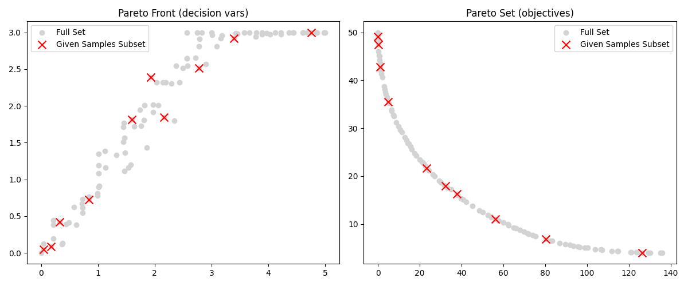

# Interactive Multi-Objective Optimisation with DRSA (IMO-DRSA)

A Python implementation of the Interactive Multi-Objective Optimisation framework using the Dominance-Based Rough Set Approach (IMO-DRSA). 
This interactive and iterative optimisation process integrates human decision-making preferences via DRSA rule induction, continually refining the Pareto-optimal solutions.

## Overview

### Framework Components
**IMO-DRSA Engine** (`engine.py`):
- Manages iterative optimisation loops (using NSGA-II to calculate Pareto fronts).
- Visualises Pareto fronts and objective spaces interactively.
- Generates new constraints dynamically based on decision-maker selections.


**Dominance-Based Rough Set Approach (DRSA)** (`drsa.py`):
- Induces decision rules distinguishing preferred solutions ('good') from non-preferred ones.
- Computes positive/negative cones, rough approximations, and quality metrics.
- Supports association rule mining for enhanced decision-context understanding.
- **Note**: All objective functions are considered to be gain-type!


**Decision Makers** (`decision_maker.py`):
- **InteractiveDM**: Integrates human input to classify Pareto samples and select DRSA rules.
- **AutomatedDM**: Automatically classifies, selects rules, and checks convergence criteria.
- **DummyDM**: Provides trivial decision-making logic for unit tests.


**Problem Extender** (`problem_extender.py`):
- Enables the ability of adding inequality constraints to pymoo optimisation problems dynamically.
- Compatible with both elementwise and batch evaluations.


## Iterative Optimisation Cycle

### A. **Optimisation Stage**: Generate a Pareto-optimal solution set (via NSGA-II).


### B. **Dialogue Stage**:
- Decision-maker classifies solutions ('good'/'other').
- DRSA infers decision rules based on classified solutions.
- Decision-maker selects the most relevant rules.
- Rules become constraints to refine the Pareto search space.

The cycle continues until a satisfactory solution set emerges or convergence criteria are met.

Note, that all explicit objective functions passed to the engine must be gain type!
(Note: This is only for the objectives passed the engine, not in the problem itself!)
---

# Example
You can find an example implementation in the `Main.py`. Here is a step-by-step on how this looks:

> **Notation**  
> - X : Current sample of Pareto-optimal decision vectors.  
> - F(X) : Corresponding matrix of objective evaluations.  
> - "good" : Label assigned by DM to preferred solutions.  
> - Rule indices refer to rows generated by association or decision-rule algorithms.

Note here, that in the following example (as seen in `Main.py`), the objectives were given to DRSA as gain-type functions,
i.e., as -F(x). However, in the printout, this was reversed, so the inequalities hold for the actual functions!

---

```

Total size of Pareto Front: 50

Association Rules:
If objective 1 is higher, objective 2 tends to be lower (support=0.50, confidence=1.00)
If objective 1 is lower, objective 2 tends to be higher (support=0.50, confidence=1.00)
If objective 2 is higher, objective 1 tends to be lower (support=0.50, confidence=1.00)
If objective 2 is lower, objective 1 tends to be higher (support=0.50, confidence=1.00)

Current Pareto sample (X) and their evaluation (F(X)):
 #   [x_1, ..., x_n]  [f_1(x), ..., f_m(x)]
[0] [2.4962, 2.5982]     [51.9286, 12.0372]
[1] [4.1919, 2.9246]     [104.5028, 4.9602]
[2] [2.5820, 2.2457]     [46.8401, 13.4328]
[3] [1.6819, 2.2446]     [31.4684, 18.6019]
[4] [3.0748, 2.8409]      [70.1006, 8.3681]
[5] [2.0797, 2.1940]     [36.5552, 16.4018]
[6] [1.8228, 2.0680]     [30.3968, 18.6913]
[7] [1.9738, 2.5005]     [40.5939, 15.4052]
[8] [1.4911, 1.7112]     [20.6065, 23.1285]
[9] [1.5662, 2.2383]     [29.8522, 19.4177]

Select indices (#) of samples with 'good' evaluation (comma-separated) 
(Press Enter if none are satisfactory): 
8


```


```
Based on your selection, the following Decision Rules were induced:
[0] [CERTAIN] IF f_1(x) <= 20.6064711278722 THEN x is 'good' (support=0.10, confidence=1.00)

Select rule(s) to enforce in the next iteration (comma-separated) 
(Press enter to skip): 0
Total size of Pareto Front: 24

Current Pareto sample (X) and their evaluation (F(X)):
 #   [x_1, ..., x_n]  [f_1(x), ..., f_m(x)]
[0] [0.4712, 0.2217]      [1.0846, 43.3423]
[1] [0.8413, 0.2462]      [3.0737, 39.8931]
[2] [1.0530, 1.3266]     [11.4744, 29.0729]
[3] [0.6145, 0.8874]      [4.6603, 36.1461]
[4] [0.0650, 0.0582]      [0.0305, 48.7751]
[5] [0.4413, 0.1324]      [0.8492, 44.4752]
[6] [1.0570, 1.1684]      [9.9300, 30.2281]
[7] [1.4574, 1.1797]     [14.0630, 27.1447]
[8] [0.1422, 0.2374]      [0.3063, 46.2805]
[9] [1.3492, 1.8011]     [20.2565, 23.5617]
Do you want to undo the last selection? (y/n): n

Would you like to terminate? (y, n): y
DM is satisfied. Terminating Process
Saved Pareto front to: ..\..\results\results_20250531_191744\pareto_front.csv
Saved Pareto set to: ..\..\results\results_20250531_191744\pareto_set.csv
Saved rules to: ..\..\results\results_20250531_191744\rules.json
```
 iteration of the Pareto Front and the given sample subset.")

# Dependencies
This project requires the following Python packages (as specified in `requirements.txt`):

- **pymoo** (0.6.1.5) 
- **numpy** (2.2.4)  
- **pandas** (2.2.3)  
- **matplotlib** (3.10.1)  
- **scipy** (1.15.2)  
- **scikit-learn** (1.6.1)  
- **plotly** (6.1.2)  
- **mlxtend** (0.23.4)  


# Sources

- Branke, J., Deb, K., Miettinen, K., & Słowiński, R. (2008). *Multiobjective optimisation: Interactive and evolutionary approaches*. Springer. [Link](https://doi.org/10.1007/978-3-540-88908-3)
- [Dominance-based Rough Set Approach (DRSA)](https://en.wikipedia.org/wiki/Dominance-based_rough_set_approach)
- [Rough Set Theory](https://en.wikipedia.org/wiki/Rough_set)
- [Multi-Criteria Decision Analysis (MCDA)](https://en.wikipedia.org/wiki/Multi-criteria_decision_analysis)
- [pymoo Optimisation Library](https://pymoo.org/)

# Licenses

This project includes third-party software ([pymoo](https://pymoo.org/)) licensed under the MIT License.
