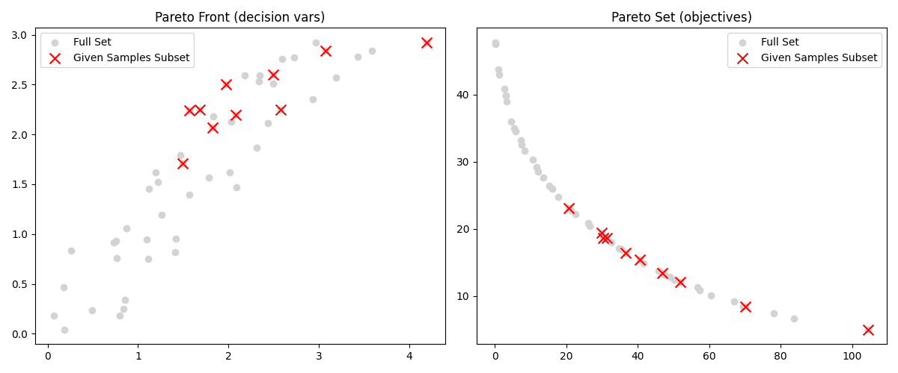

# Interactive Multi-Objective Optimisation with DRSA (IMO-DRSA)

A Python implementation of the Interactive Multi-Objective Optimisation framework using the Dominance-Based Rough Set Approach (IMO-DRSA). 
This interactive and iterative optimisation process integrates human decision-making preferences via DRSA rule induction, continually refining the Pareto-optimal solutions.

## Overview

### Framework Components
**IMO-DRSA Engine** (`engine.py`):
- Manages iterative optimisation loops (using NSGA-II to calculate Pareto fronts).
- Visualises Pareto fronts and objective spaces interactively.
- Generates new constraints dynamically based on decision-maker selections.


**Dominance-Based Rough Set Approach (DRSA)** (`drsa.py`):
- Induces decision rules distinguishing preferred solutions ('good') from non-preferred ones.
- Computes positive/negative cones, rough approximations, and quality metrics.
- Supports association rule mining for enhanced decision-context understanding.


**Decision Makers** (`decision_maker.py`):
- **InteractiveDM**: Integrates human input to classify Pareto samples and select DRSA rules.
- **AutomatedDM**: Automatically classifies, selects rules, and checks convergence criteria.
- **DummyDM**: Provides trivial decision-making logic for unit tests.


**Problem Extender** (`problem_extender.py`):
- Enables the ability of adding inequality constraints to pymoo optimisation problems dynamically.
- Compatible with both elementwise and batch evaluations.


## Iterative Optimisation Cycle

### A. **Optimisation Stage**: Generate a Pareto-optimal solution set (via NSGA-II).


### B. **Dialogue Stage**:
- Decision-maker classifies solutions ('good'/'other').
- DRSA infers decision rules based on classified solutions.
- Decision-maker selects the most relevant rules.
- Rules become constraints to refine the Pareto search space.

The cycle continues until a satisfactory solution set emerges or convergence criteria are met.


---

# Example
You can find an example implementation in the `Main.py`. Here is a step-by-step on how this looks:

> **Notation**  
> - X : Current sample of Pareto-optimal decision vectors.  
> - F(X) : Corresponding matrix of objective evaluations.  
> - "good" : Label assigned by DM to preferred solutions.  
> - Rule indices refer to rows generated by association or decision-rule algorithms.

---

```
Total size of pareto front: 100

Association Rules:
If objective 1 is higher, objective 2 tends to be lower (support=0.50, confidence=1.00)
If objective 1 is lower, objective 2 tends to be higher (support=0.50, confidence=1.00)
If objective 2 is higher, objective 1 tends to be lower (support=0.50, confidence=1.00)
If objective 2 is lower, objective 1 tends to be higher (support=0.50, confidence=1.00)

Current Pareto sample (X) and their evaluation (F(X)):
 #   [x_1, ..., x_n]  [f_1(x), ..., f_m(x)]
[0] [0.0450, 0.0450]      [0.0162, 49.1037]
[1] [0.8431, 0.7236]      [4.9378, 35.5672]
[2] [1.9280, 2.3881]     [37.6803, 16.2593]
[3] [3.3985, 2.9221]      [80.3547, 6.8824]
[4] [0.3294, 0.4216]      [1.1450, 42.7761]
[5] [0.1722, 0.0855]      [0.1478, 47.4604]
[6] [2.1595, 1.8487]     [32.3243, 17.9993]
[7] [2.7820, 2.5157]     [56.2735, 11.0911]
[8] [4.7558, 3.0000]     [126.4708, 4.0596]
[9] [1.6017, 1.8102]     [23.3691, 21.7233]

Select indices (#) of samples with 'good' evaluation (comma-separated) 
(Press Enter if none are satisfactory): 
9
```


```
Based on your selection, the following Decision Rules were induced:
[0] [CERTAIN] IF f_1(x) <= 0.016212545612520765 AND f_2(x) <= 49.103704728167436 THEN x is 'good' (support=0.10, confidence=1.00)
[1] [CERTAIN] IF f_1(x) <= 4.9378262588686095 AND f_2(x) <= 35.56717100668167 THEN x is 'good' (support=0.10, confidence=1.00)
[2] [CERTAIN] IF f_1(x) <= 37.68031799723687 AND f_2(x) <= 16.25932901605619 THEN x is 'good' (support=0.10, confidence=1.00)
[3] [CERTAIN] IF f_1(x) <= 80.35472428429821 AND f_2(x) <= 6.882381468132873 THEN x is 'good' (support=0.10, confidence=1.00)
[4] [CERTAIN] IF f_1(x) <= 1.14500702821959 AND f_2(x) <= 42.77613722837148 THEN x is 'good' (support=0.10, confidence=1.00)
[5] [CERTAIN] IF f_1(x) <= 0.1478147826455799 AND f_2(x) <= 47.46042632034455 THEN x is 'good' (support=0.10, confidence=1.00)
[6] [CERTAIN] IF f_1(x) <= 32.324252428047444 AND f_2(x) <= 17.999250919740916 THEN x is 'good' (support=0.10, confidence=1.00)
[7] [CERTAIN] IF f_1(x) <= 56.273519334162614 AND f_2(x) <= 11.091148611918758 THEN x is 'good' (support=0.10, confidence=1.00)
[8] [CERTAIN] IF f_1(x) <= 126.47080005082924 AND f_2(x) <= 4.059630326864898 THEN x is 'good' (support=0.10, confidence=1.00)
[9] [CERTAIN] IF f_1(x) <= 23.369050856258713 AND f_2(x) <= 21.72327047368539 THEN x is 'good' (support=0.10, confidence=1.00)

Select rule(s) to enforce in the next iteration (comma-separated) 
(Press enter to skip): 9

Total size of pareto front: 1000

Current Pareto sample (X) and their evaluation (F(X)):
 #   [x_1, ..., x_n]  [f_1(x), ..., f_m(x)]
[0] [1.7081, 1.7058]     [23.3098, 21.6882]
[1] [1.7098, 1.7049]     [23.3191, 21.6837]
[2] [1.7042, 1.7049]     [23.2427, 21.7206]
[3] [1.7043, 1.7056]     [23.2535, 21.7153]
[4] [1.7088, 1.7077]     [23.3446, 21.6714]
[5] [1.7076, 1.7091]     [23.3469, 21.6703]
[6] [1.7039, 1.7069]     [23.2666, 21.7090]
[7] [1.7054, 1.7067]     [23.2847, 21.7003]
[8] [1.7032, 1.7064]     [23.2503, 21.7169]
[9] [1.7085, 1.7092]     [23.3614, 21.6633]
Do you want to undo the last selection? (y/n): n

Would you like to terminate? (y, n): y

DM is satisfied. Terminating Process
```
 iteration of the Pareto Front and the given sample subset.")

# Dependencies
This project requires the following Python packages (as specified in `requirements.txt`):

- **pymoo** (0.6.1.5) 
- **numpy** (2.2.4)  
- **pandas** (2.2.3)  
- **matplotlib** (3.10.1)  
- **scipy** (1.15.2)  
- **scikit-learn** (1.6.1)  
- **plotly** (6.1.2)  
- **mlxtend** (0.23.4)  


# Sources

- Branke, J., Deb, K., Miettinen, K., & Słowiński, R. (2008). *Multiobjective optimisation: Interactive and evolutionary approaches*. Springer. [Link](https://doi.org/10.1007/978-3-540-88908-3)
- [Dominance-based Rough Set Approach (DRSA)](https://en.wikipedia.org/wiki/Dominance-based_rough_set_approach)
- [Rough Set Theory](https://en.wikipedia.org/wiki/Rough_set)
- [Multi-Criteria Decision Analysis (MCDA)](https://en.wikipedia.org/wiki/Multi-criteria_decision_analysis)
- [pymoo Optimisation Library](https://pymoo.org/)

# Licenses

This project includes third-party software ([pymoo](https://pymoo.org/)) licensed under the MIT License.
